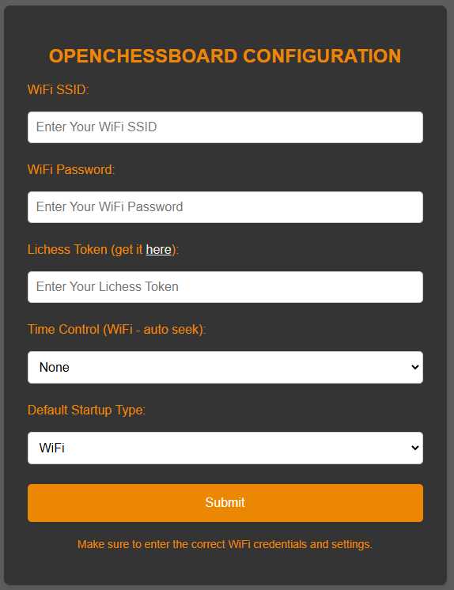
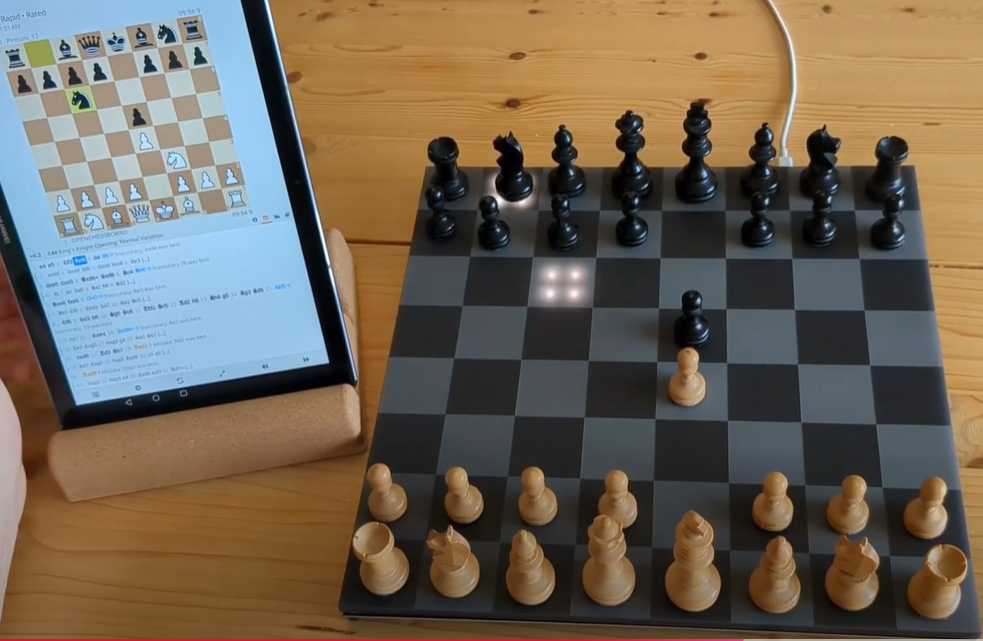

# The OPENCHESSBOARD - Build your own smart chess board
The OPENCHESSBOARD is an open-source smart chess board to play online chess on a physical chess board. 
You can start playing with using the openchessboard hardware from [OPENCHESSBOARD.com](http://openchessboard.com/), or build your own project from scratch and use this code as starting point.
The firmware for the chessboard aims to be a developer platform so you could easily integrate new game ideas or customize the firmware to your needs.

# Main Features
You can select between two connectivity modes:
- **WiFi (stand-alone play):**
You can connect the board directly to the Lichess server and can use the board completely as standaloine device without interaction of third party apps.
During start-up, the board hosts a WiFi access-point where you can enter your prefered settings and game-mode. Later on the board simply starts a new game with your default time-control.
[View the Access Point](/data/access_point.html)

- **BLE (app play):**
You can connect the board directly to the [Blichess App](https://play.google.com/store/search?q=blichess&c=apps&hl=de_CH) which implements bluetooth connectivity in the standard Lichess App. When using bluetooth and the Blichess App, the board is a simple input device and everything else is handled via the app. You simply connect the board in the bluetooth settings of the app and can start playing, analyzing or record offline games played on the board.
You can checkout this video to see how it works:
[BLE/App demo](https://www.youtube.com/watch?v=-bQ3twI99CM)

# Requirements
This project runs on Arduino Nano esp32 with the OPENCHESSBOARD hardware.

# How to play
### 1. Blink patterns after power up
- All LEDs light up simultaneously (Hardware power-up)
-  a4 blinking (connecting to wifi)
- Center squares blinking (searching for ongoing game)
- All LEDs off (it is your move and it is the first move of the game)
- Two squares light up  (it is your move but you need to input the last move played)
### 2. How to move
- 	**Pick and place:** When picking up the piece you want to move, the LED lights up where the piece was originally.
You can keep the piece as long as you want in your hand and when you place it on the end square,
the board registers this square by lighting up the LED. 
- 	**Slide:** While moving a piece via sliding, the board blocks all unintentional inputs until you keep the piece at rest for about 300ms.
### 3. How to capture
The board works by registering the start square of a move first and then waiting for the end square where the piece moves. 
Therefore when capturing a piece you need to pick up the piece you want to move first and only then pick up the piece you want to caputure.
- **One handed:** You could use one hand to pick up both pieces starting with your piece first.
- **Two handed:** You could use two hands to pick up your piece first and use the other hand to take the captured piece.
To ensure proper move input wait until the LED lights up below the captured piece and only then place your piece on the square.
### 4. Castling
Castling registeres as king move which means you need to move your king first and the jump the rook over.
### 5. Take back (wrong move)
A wrong move is indicated by lighting up both squares of the move you just played. 
You need to play the move in reverse as take back and if all LEDs are off again you can make a different move.
### 6. Unexpected issues
- Only one square lights up below a piece you havent moved yet. 
This means the piece was slightly misplaced and the board registers a wrong starting square as move input.
Just lift the piece on that square and wait until the LED turns off. If all LEDs are off again, you can make your move as usual.
- The board keeps requesting take backs.
This means you lost WiFi connection and need to reconnect to WiFi and the ongoing game. Unplug the board  wait 1 second and reconnect the power. 
The board then reconnects again to the game and starts from the last known position.
- If you somehow knockover multiple pieces the most simple way is to unplug the board, reset all pieces and then power it up. 
This process only takes a few seconds and the board reconnects to the game and starts from the last known position.
# How to support this project?
You can order the hardware from [OPENCHESSBOARD.com](http://openchessboard.com/) and thereby keeping the project alive. 
If you simply want to support, please think about becoming a patrion:
[Become a Patrion](https://openchessboard.zahls.ch/pay?cid=4e8bead9)

# Acknowledgements
Without Lichess.org and their well documented [open-source API](https://lichess.org/api) this project would not be possible.
Without the fundamental work of [Włodzimierz Ciesielski (vovagorodok)](https://github.com/vovagorodok) the bluetooth connection would not be possible. 

